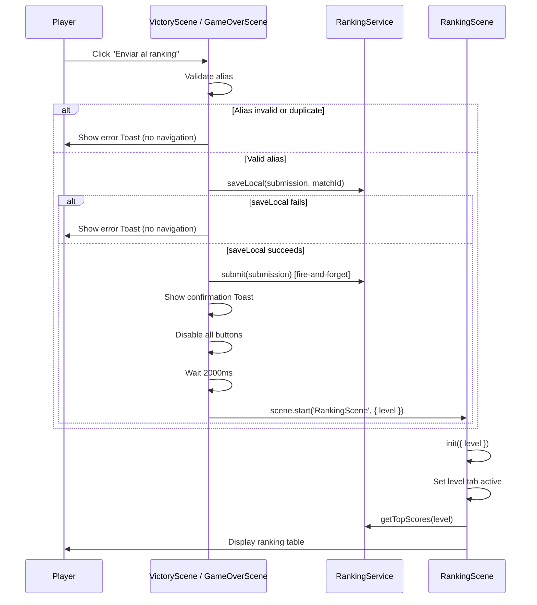

# Design Document: Show Ranking After Submit

## Overview

This feature modifies the ranking submission flow in both `VictoryScene` and `GameOverScene` to automatically navigate the player to `RankingScene` after submitting their score. Currently, clicking "Enviar al ranking" performs the submission and shows a toast confirmation, but the player remains on the results screen. The new behavior adds:

1. A 2-second delay after the toast appears (so the player can read the confirmation message).
2. Automatic scene transition to `RankingScene` with the played level passed as a parameter.
3. `RankingScene` receives the level parameter and pre-selects the corresponding tab, showing rankings for that level immediately.
4. Navigation is blocked if alias validation fails or deduplication prevents submission.
5. If `saveLocal()` fails, no navigation occurs and an error toast is shown.

The feature is intentionally minimal in scope — it reuses existing components (`Toast`, `Button.setEnabled`, `RankingScene` level tabs) and adds a delayed `scene.start()` call with parameter passing.

## Architecture



### Key Architectural Decisions

| Decision | Rationale |
|----------|-----------|
| Navigation occurs after `saveLocal()` succeeds, regardless of remote `submit()` result | The player's score is preserved locally even if the network fails. The ranking table will show at least local data. |
| 2000ms delay before transition | Matches the existing `TOAST_DURATION` (1800ms) plus a small buffer, giving the player time to read the confirmation. |
| Buttons disabled during delay | Prevents accidental double-navigation or scene interruption during the transition window. |
| Navigation inputs (Tab, Escape) ignored during delay | Consistent with button disabling — the entire scene is "locked" during the transition countdown. |
| `RankingScene` receives level via `init(data)` | Follows existing Phaser scene data-passing pattern already used throughout the project. |
| Cancel pending transition on scene destroy | Prevents orphaned `delayedCall` from navigating after the scene is already gone (e.g., if the browser tab is closed). |

## Components and Interfaces

### Modified Components

#### 1. `VictoryScene.handleSubmitRanking()` (modified)

Current behavior: Shows toast after submit. New behavior: After `saveLocal()` succeeds, shows toast, disables buttons, schedules navigation after 2000ms.

```typescript
// New method added to VictoryScene
private scheduleRankingTransition(): void {
  // Disable all interactive elements
  this.focusableElements.forEach(btn => btn.setEnabled(false));
  this.transitionBlocked = true;

  // Schedule navigation
  this.pendingTransition = this.time.delayedCall(2000, () => {
    this.scene.start('RankingScene', { level: this.level });
  });
}
```

#### 2. `GameOverScene.handleSubmitRanking()` (modified)

Same pattern as VictoryScene — identical logic extracted into the same transition scheduling approach.

#### 3. `RankingScene.init(data)` (new method)

Currently `RankingScene` has no `init` method and always defaults to level 1. The new `init` method receives and validates the level parameter:

```typescript
init(data?: { level?: number }): void {
  const rawLevel = data?.level;
  if (rawLevel === 1 || rawLevel === 2 || rawLevel === 3) {
    this.selectedLevel = rawLevel;
  } else {
    this.selectedLevel = 1; // Default fallback
  }
}
```

### New Properties on VictoryScene / GameOverScene

| Property | Type | Purpose |
|----------|------|---------|
| `transitionBlocked` | `boolean` | Flag to ignore navigation inputs during transition delay |
| `pendingTransition` | `Phaser.Time.TimerEvent \| null` | Reference to the delayed call, used for cancellation on scene destroy |

### Interface: RankingScene init data

```typescript
interface RankingSceneData {
  level?: 1 | 2 | 3;
}
```

## Data Models

No new data models are introduced. The feature reuses existing types:

- **`RankingSubmission`** — unchanged, used for the submit payload.
- **`RankingEntry`** — unchanged, used for display in RankingScene.
- **Scene init data** — Phaser's standard `init(data)` pattern with a simple `{ level: 1 | 2 | 3 }` object passed via `scene.start()`.

### Scene Transition Data Flow

| From | To | Data Passed |
|------|----|-------------|
| `VictoryScene` | `RankingScene` | `{ level: 1 \| 2 \| 3 }` |
| `GameOverScene` | `RankingScene` | `{ level: 1 \| 2 \| 3 }` |
| `MenuScene` (nav bar) | `RankingScene` | No data (defaults to level 1) |


## Correctness Properties

*A property is a characteristic or behavior that should hold true across all valid executions of a system — essentially, a formal statement about what the system should do. Properties serve as the bridge between human-readable specifications and machine-verifiable correctness guarantees.*

### Property 1: Successful submission navigates with correct level

*For any* valid level (1, 2, or 3) and valid alias, if `RankingService.saveLocal()` succeeds, then the submission handler SHALL schedule navigation to RankingScene with that exact level value as the parameter, regardless of whether `RankingService.submit()` succeeds or fails.

**Validates: Requirements 1.1, 1.2, 2.1, 2.2**

### Property 2: Level parameter initialization

*For any* value passed to `RankingScene.init(data)` where `data.level` is exactly 1, 2, or 3, the scene's `selectedLevel` SHALL equal that value after initialization.

**Validates: Requirements 1.3, 2.4, 4.3**

### Property 3: Invalid level parameter defaults to 1

*For any* value passed to `RankingScene.init(data)` where `data.level` is NOT 1, 2, or 3 (including undefined, null, 0, negative numbers, numbers > 3, non-numbers), the scene's `selectedLevel` SHALL equal 1 after initialization.

**Validates: Requirements 1.4**

### Property 4: Invalid alias blocks navigation

*For any* string that fails alias validation (empty string, whitespace-only, longer than 16 characters, or containing characters outside `[a-zA-Z0-9 ]`), invoking the submit handler SHALL NOT schedule any navigation to RankingScene.

**Validates: Requirements 5.1, 5.2**

### Property 5: Deduplication blocks navigation

*For any* matchId where the in-memory `submitted` flag is true OR `RankingService.isAlreadySubmitted(matchId)` returns true, invoking the submit handler SHALL NOT schedule any navigation to RankingScene.

**Validates: Requirements 5.3, 5.4**

## Error Handling

| Error Condition | Behavior | User Feedback |
|----------------|----------|---------------|
| `RankingService.saveLocal()` throws | No navigation occurs; stay on current scene | Toast: "No se pudo guardar el puntaje" (red) |
| `RankingService.submit()` throws | Navigation still occurs (score saved locally) | Toast: "Resultado guardado localmente" (orange), then transition |
| Invalid alias | No navigation occurs; stay on current scene | Toast: "Alias inválido" with format hint (red) |
| Duplicate submission | No navigation occurs; stay on current scene | Toast: "Ya registrado" (orange) |
| Scene destroyed during delay | `pendingTransition` timer cancelled via `this.pendingTransition.remove()` | None (scene is gone) |
| `RankingScene.getTopScores()` fails after navigation | Empty state or error toast within RankingScene | Toast: "Ranking temporalmente no disponible" (existing behavior) |

### Error Flow: saveLocal Failure

```typescript
try {
  RankingService.saveLocal(submission, this.matchId);
} catch {
  Toast.show(this, {
    text: 'No se pudo guardar',
    subtext: 'Intentá de nuevo más tarde',
    color: '#ff6644',
    x: GAME_WIDTH / 2,
    y: GAME_HEIGHT / 2,
  });
  return; // Do NOT navigate
}
```

Currently `RankingService.saveLocal()` catches errors internally and fails silently. To implement Requirement 2.3, we need to detect if the save actually succeeded. Two approaches:

1. **Make `saveLocal()` throw on failure** — breaking change, affects other callers.
2. **Add a `trySaveLocal()` variant that returns a boolean** — backward-compatible.

**Decision:** Add a new `saveLocalOrThrow()` method (or modify submit handler to verify the save by reading back from localStorage after `saveLocal()`). The simplest approach is to check `isAlreadySubmitted(matchId)` after calling `saveLocal()` — if it returns `false`, the save failed.

### Transition Cancellation on Scene Destroy

```typescript
// In scene's shutdown or destroy handler:
shutdown(): void {
  if (this.pendingTransition) {
    this.pendingTransition.remove(false);
    this.pendingTransition = null;
  }
}
```

## Testing Strategy

### Unit Tests (Vitest)

| Test | What it validates |
|------|-------------------|
| `RankingScene.init` with valid levels (1, 2, 3) | Sets selectedLevel correctly |
| `RankingScene.init` with invalid/missing values | Defaults to level 1 |
| Alias validation function (extracted) | Rejects invalid aliases, accepts valid ones |
| Submit decision logic (extracted) | Returns correct action (navigate/block) based on inputs |

### Property-Based Tests (Vitest + fast-check)

Property-based tests verify universal properties across many generated inputs.

**Library:** `fast-check` (already suitable for the TypeScript/Vitest stack)
**Minimum iterations:** 100 per property

| Property Test | References |
|---------------|------------|
| Level parameter validation round-trip | Property 2, Property 3 |
| Invalid alias never triggers navigation | Property 4 |
| Successful flow always produces navigation with correct level | Property 1 |
| Deduplication always blocks navigation | Property 5 |

**Tag format for property tests:**
```typescript
// Feature: show-ranking-after-submit, Property 2: Level parameter initialization
```

### Integration Tests (Manual / Smoke)

| Scenario | Steps |
|----------|-------|
| Happy path from VictoryScene | Complete level → submit alias → verify toast → verify RankingScene shows correct level tab |
| Happy path from GameOverScene | Lose level → submit alias → verify toast → verify RankingScene shows correct level tab |
| Network failure | Disable network → submit → verify local toast → verify navigation still happens |
| Invalid alias | Enter special chars → submit → verify error toast → verify no navigation |
| Double submit | Submit once → try again → verify dedup toast → verify no navigation |
| Escape during delay | Submit → immediately press Escape → verify no premature navigation |

### What PBT Tests vs. What Unit/Integration Tests

- **PBT covers:** Input space exploration (all possible aliases, all possible level values, all combinations of submit success/failure/dedup states)
- **Unit tests cover:** Specific examples, timer setup/cancellation, Phaser API interactions (mocked)
- **Integration tests cover:** End-to-end flow through actual Phaser scenes, visual confirmation of toast display and tab highlighting
